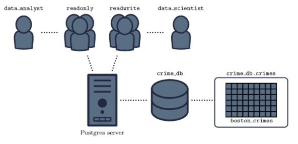

# Building a Postgres DB for Crime Reports

### Project Aim

The aim of the project is to create an optimal database named crimes_db to store data on crime reports primarily available in the CSV format.

### Outcomes
 

### Data Collection

The project uses CSV data on crime reports in Boston.

### Techniques
<ul>
    <li>Psycopg2</li>
    <li>PostgreSQL</li>
    <li>DB Schemas</li>
    <li>DB Users and Groups Administration (privileges)</li>
    <li>DB Tables, Columns and Data Types</li>
</ul>